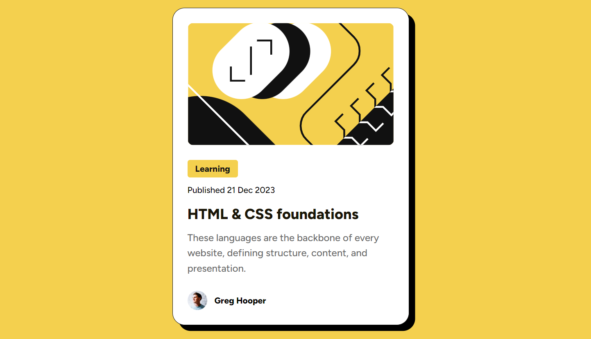

Frontend Mentor - Blog Preview Card Solution
This is a solution to the Blog preview card challenge on Frontend Mentor.

- The challenge
  Screenshot
  

- My process
  Built with
  Semantic HTML5 markup
  CSS custom properties
  Flexbox
  Mobile-first workflow

- What I learned
  While working on this project, I reinforced my understanding of flexbox, semantic HTML, and custom CSS properties.

See hover and focus states for all interactive elements on the page.
